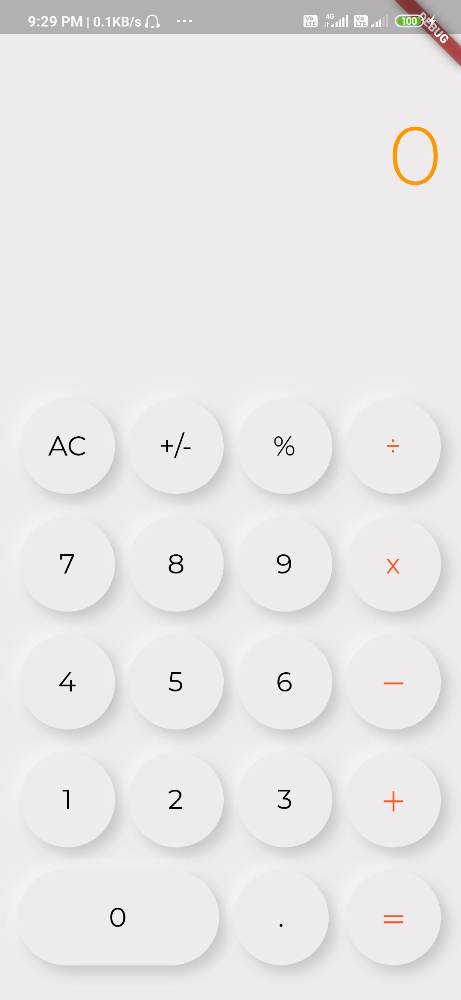
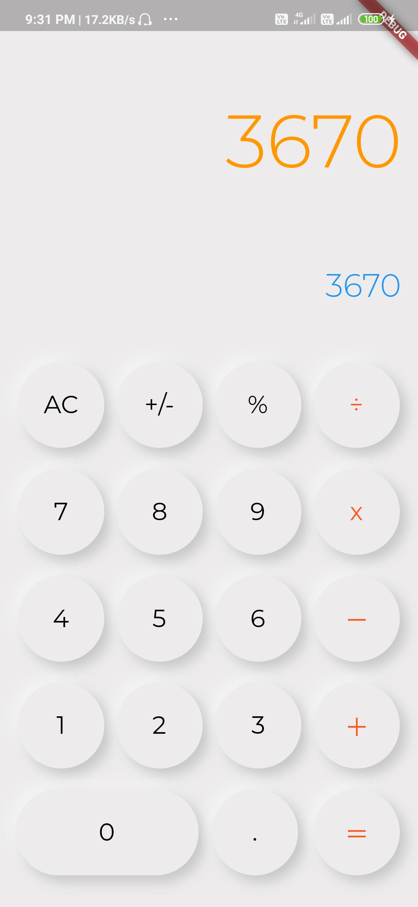

# CALCULATOR APP

A simple calculator application that can be used for simple arithmetic calculation.
This application is made using a neumorphic flutter package.
limitation: the result is limited to 7 digits after that if u want to add more digit
then it shows three dots in the result. And same for the operation text that is under the result text.

## SCREENSHOTS

<table>
 <tr>
   <td>FIRST SCREEN</td>
   <td>RESULT SCREEN</td>
 </tr>
 <tr>
   <td></td>
   <td></td>
 </tr>
</table>